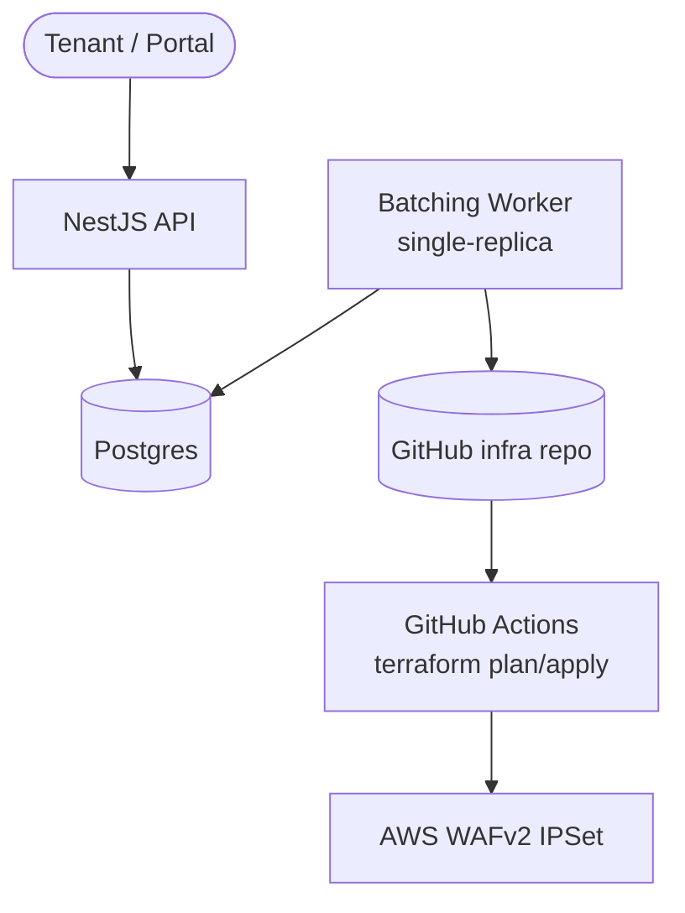
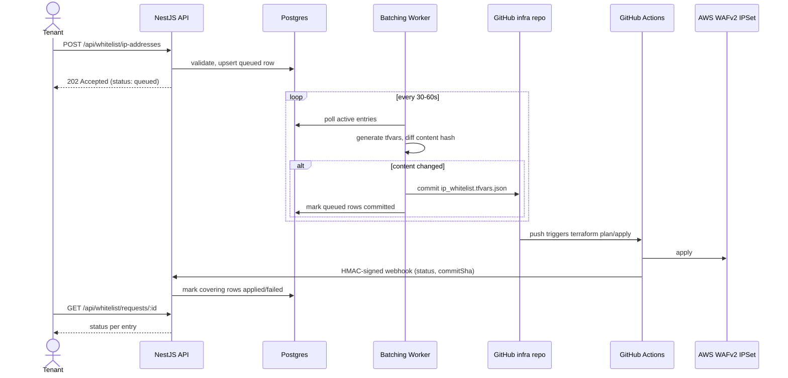

# WebSG Custom — Self-Service IP Whitelist Portal (Backend)

## 1. Problem Recap

Tenants file service requests to add/remove IPs on a shared AWS WAF whitelist gating CMS access.
Goal: a self-service API so tenants manage their own IPs, cutting the platform team's operational
load.

## System Overview

Components at a glance (the webhook return path — Actions back to the API — is omitted here for a
compact layout; see the sequence diagram below for that detail):



The same flow, with request/response and async webhook detail:



The backend never calls AWS directly (see the direct-SDK option rejected in section 3) — every
change flows through Git so it stays inside the platform's existing Terraform + review model.

## 2. Assumptions

| # | Assumption | Rationale / Impact |
|---|---|---|
| 1 | Whitelist is currently a single **shared** AWS WAF `IPSet`, referenced by a WAF rule in front of the CMS ALB/CloudFront. | Matches "shared set of whitelisted IP addresses...used by all tenants" in the brief. |
| 2 | Infra changes normally flow through **Terraform + Git + GitOps (ArgoCD)**, per the platform's stated operating model. | Drives the core design decision below. |
| 3 | Tenant identity is already established upstream (portal auth — e.g., Cognito/OIDC) and the backend receives a verified tenant ID via JWT. | Out of scope to build auth from scratch; API just needs to *enforce* it. |
| 4 | Today's whitelist has no tenant attribution (flat list) — tenant-specific whitelists are a **future** bonus item, not current scope. | Keeps MVP API tenant-agnostic on the WAF side but tenant-scoped on the request/audit side (see section 6). |
| 5 | Update frequency is low-to-moderate (human-driven, not high-QPS), so a few seconds to minutes of propagation latency via GitOps is acceptable. | Justifies choosing correctness/auditability over raw speed. |
| 6 | No production AWS access — solution is code + documented mechanism, not deployed infra. | Per assignment note. |
| 7 | Backend exposes a **webhook receiver** GitHub Actions calls after `terraform apply` completes (status + commit SHA), rather than backend polling CI. | Testable contract vs. an unspecified polling loop; GitHub Actions is what's implemented, but the tool is swappable. |

## 3. Core Decision: How Updates Reach AWS WAF

Two viable mechanisms — chose one, documented the trade-off:

### Option A — Direct SDK call (`wafv2:UpdateIPSet`)
- Backend calls AWS directly on each tenant request.
- ✅ Simple, low latency (seconds).
- ❌ Bypasses Terraform state → **drift**: next `terraform plan` may revert tenant changes or show a permanent diff. Breaks the platform's own IaC/audit story.

### Option B — GitOps-native (chosen)
- Backend validates the request, then **commits a change** to the Terraform-managed IP set
  source file (e.g., `ip_whitelist.tfvars.json`) in the infra repo, on a dedicated branch, and opens
  a PR — or pushes straight to an auto-apply branch.
- **Note**: this is the *Terraform* pipeline, not the K8s GitOps/ArgoCD one — ArgoCD only
  reconciles Kubernetes manifests, never Terraform-managed AWS resources like a WAF `IPSet`. The
  brief describes two separate flows; this update belongs to the Terraform + Git + code-review one.
  See section 3a for the concrete flow.
- ✅ Consistent with platform's existing model, gets change review/audit trail without extra tooling.
- ❌ Slower (propagation = commit → CI → apply, ~1–5 min), more moving parts (Git write access,
  merge/apply automation).

### 3a. Concrete Flow: Backend → DB → Git → Terraform Apply

1. **Backend validates** the tenant's add/remove request (section 4 rules).
2. **Backend writes to its own database** (`whitelist_entries`, unique on `(tenant_id, ip)`) — the
   system's source of truth, not the Git file. Concurrent requests serialize through the DB, not a
   Git read-merge-write. Multiple tenants may hold their own row for the same IP (section 4).
3. Respond `202 Accepted` immediately with `status: "queued"` (section 3c — the actual Git push
   happens on a batch cycle, not per-request).
4. **A scheduled worker** (section 3c) generates the full `ip_whitelist.tfvars.json` from a
   **`DISTINCT`, sorted union of IPs** across active tenant rows — dedup happens here, since two
   tenants can legitimately share an IP at the DB level. Sorting keeps diffs deterministic. Pushed
   via the Git provider's Contents API (needs the file's current `sha` for optimistic concurrency —
   a cheap metadata read, not a full fetch-then-merge).
5. **CI triggers `terraform plan`/`apply`**, scoped to the isolated whitelist module (section 3d).
   **Assumption**: the brief doesn't specify the CI tool — GitHub Actions is assumed for
   concreteness; the design doesn't depend on which one.
6. **Terraform apply** updates the actual AWS WAF `IPSet` resource.
7. **Status feedback**: backend receives a CI webhook on apply result, updates all DB rows covered
   by that commit to `applied`/`failed`. Tenant polls `GET /api/whitelist/requests/:id` for status.

### 3c. Batching Commits

Committing on every tenant request is risky beyond Git API rate limits — each commit to `main` can
trigger a separate `terraform apply` (a shared, stateful operation per section 3d); N rapid
requests → N applies is noisy and risky.

- Tenant requests are validated and written to the DB immediately (section 3a step 2), responding
  `202` with `status: "queued"` — no change to the API contract, just a realistic async latency.
- A scheduled worker runs every **30–60s**: if the desired whitelist state has changed since the
  last successful commit, it generates the full JSON from DB and pushes **one commit** covering
  everything queued in that window.
- All DB rows included in that commit move to `committed`, then `applied`/`failed` once CI reports
  back (step 7 above).
- Trade-off: a tenant's change reflects in AWS with up to one batch-window's added latency — batch
  interval is a tunable that trades latency against Git/CI churn.

### 3d. Blast-Radius Risk: Shared `terraform apply` Scope

Risk: if the whitelist commit lands on `main` and CI runs a repo-wide `terraform apply`, it applies
**everything currently merged but not yet applied** — not just the whitelist diff. A tenant clicking
"add IP" could inadvertently ship someone else's in-flight infra change. Two mitigations, used
together:

- **Isolate the whitelist into its own Terraform root module + state file** (e.g.
  `infra/cms-whitelist/`), separate from the rest of the platform infra. CI scopes `plan`/`apply` to
  that directory/state only, on whitelist-branch changes. This is the real fix — it structurally
  limits blast radius to the WAF `IPSet`, and is the standard pattern when one small piece of infra
  needs a faster, independent change cadence than the rest of the platform.
- **Plan-diff guard as defense in depth**: even with isolated state, parse the `terraform plan` JSON
  output before auto-applying, and abort to human review if the plan touches any resource other than
  the expected `aws_wafv2_ip_set`. Cheap insurance against drift or misconfiguration.

**Decision: Option B** — the brief frames the platform's operating model around Terraform + GitOps +
reviewable changes; an API that silently bypasses that would undermine the platform's own
discipline. The latency trade-off is mitigated by returning `202 Accepted` with a pollable status
(section 5), rather than blocking on WAF propagation.

*(Implementation note: the Git-write step is stubbed behind a `WhitelistPublisher` interface — a
`GitHubPublisher` implementation for the real API, and a `NoopPublisher`/logger for local testing,
since no real repo access exists in this exercise.)*

**Note on tenant attribution in the Terraform source:** `.tfvars.json` has no comments, so
attribution can't be inlined — instead it's a structured object keyed by IP, with tenant as metadata
Terraform doesn't need to consume:

```json
{
  "cms_whitelist_ips": {
    "203.0.113.5": { "tenant": "tenant_123", "addedAt": "2026-09-02T10:00:00Z" },
    "198.51.100.0/24": { "tenant": "tenant_456", "addedAt": "2026-09-01T08:30:00Z" }
  }
}
```
Terraform extracts `keys(var.cms_whitelist_ips)` for the actual WAF `IPSet` resource; the metadata
rides along in Git/state for traceability. Commit messages and the app-level audit log
(`submittedBy` in sections 5 and 6) are the primary human-readable trail.

## 4. Auth & Validation

- **AuthN**: JWT bearer token (assumed issued by portal's existing auth) — verified via middleware.
  *(Implemented via a guard trusting an `x-tenant-id` header outright, standing in for real JWT
  verification — marked as a temporary stub; see README's Testing boundary.)*
- **AuthZ**: tenant ID extracted from JWT claims; request body cannot specify a different tenant.
  Today's shared whitelist means any authenticated tenant can propose an add/remove, but every
  change is **tagged with the submitting tenant** in an audit log — laying groundwork for section 7.
- **Input validation** (class-validator / zod):
  - Each entry must be valid IPv4/IPv6 or CIDR.
  - Reject private/reserved ranges (RFC1918, loopback, link-local) — prevents whitelisting internal
    ranges by mistake.
  - Dedup entries; enforce a max list size per request (e.g. 50) to bound blast radius of one call.
  - Reject if resulting global IPSet would exceed AWS WAF's IPSet capacity limit.
- **Shared-IP handling**: uniqueness is on `(tenant_id, ip)`, not `(ip)` alone — two tenants can each
  hold their own row for the same IP (e.g. shared corporate NAT/VPN egress). Consequences:
  - `remove` only retracts the **submitting tenant's own attribution**; it never directly deletes
    from the WAF list.
  - An IP leaves the generated WAF list only when its **last remaining active tenant-attribution**
    is removed.
  - Response/status should distinguish "removed from your account" vs. "removed, but IP still
    active because tenant X also holds it" — otherwise a tenant may think their removal silently
    failed.
- **Rate limiting** on the endpoint (per tenant) to prevent abuse/flooding the GitOps pipeline with
  commits.

## 5. API Contract (sketch)

```
POST /api/whitelist/ip-addresses
Authorization: Bearer <jwt>

Body:
{
  "add": ["203.0.113.5", "198.51.100.0/24"],
  "remove": ["203.0.113.9"]
}

202 Accepted
{
  "requestId": "wl_9f2a...",
  "status": "pending",
  "statusUrl": "/api/whitelist/requests/wl_9f2a..."
}

GET /api/whitelist/requests/:id
200 OK
{
  "requestId": "wl_9f2a...",
  "status": "applied" | "pending" | "failed",
  "submittedBy": "tenant_123",
  "submittedAt": "...",
  "appliedAt": "..."
}

POST /internal/webhooks/terraform-apply
X-Hub-Signature-256: sha256=... (HMAC over raw body)

Body:
{
  "status": "success" | "failure",
  "commitSha": "..."
}

200 OK
{ "status": "ok" }
```

Third endpoint, internal only (assumption 7, section 3a step 7) — the CI-called webhook that
reports a `terraform apply` outcome back, distinct from the two tenant-facing ones above and
authenticated differently (HMAC signature, not a tenant JWT).

## 6. Testing Plan

- Unit tests: input validation (valid/invalid IP & CIDR, private-range rejection, dedup, size
  limits), authz (tenant can't spoof another tenant's ID), publisher interface (mock Git call),
  distinct-sorted-union generation logic (section 3a step 4), shared-IP removal semantics (section 4).
- **Webhook receiver**: integration test posting a simulated GitHub Actions payload (`{ status,
  commitSha, ... }`) and asserting the right DB rows transition to `applied`/`failed`, including
  rejecting payloads that fail HMAC signature verification.
- Integration-style test with an in-memory/fake `WhitelistPublisher` to verify the request →
  commit-payload mapping is correct without touching real infra.
- **Out of scope**: the actual `terraform apply` and AWS WAF `IPSet` mutation. LocalStack's free
  tier doesn't support WAFv2 (`wafv2:CreateIPSet`/`UpdateIPSet` require LocalStack Pro), so it's
  unused here; the GitHub Actions workflow is a reference artifact, not exercised in CI for this
  submission (would need real AWS credentials). Manual confidence check before submitting: apply
  against a throwaway `aws_wafv2_ip_set` in a sandbox account, confirm `Addresses` matches the
  generator's output, tear down — a one-off smoke check a grader without my credentials couldn't
  reproduce, so it's not part of the automated suite.

## 7. Bonus: Future Tenant-Specific Whitelists

- Move from one shared WAF `IPSet` to **per-tenant `IPSet`s**, each referenced by a tenant-scoped
  WAF rule (or rule group), selected via `Host` header / tenant routing already present at the
  ALB/CloudFront layer.
- Terraform-side: whitelist source becomes a map keyed by tenant ID
  (`ip_whitelists = { tenant_123 = [...], tenant_456 = [...] }`), generated into per-tenant IPSet
  resources — keeps one Terraform-managed source of truth, same GitOps flow, just parameterized.
- Migration path: seed each tenant's new IPSet from the current shared list, then cut traffic over
  rule-by-rule to avoid a lockout window.

## 8. Bonus: One Additional Self-Service Config

**HPA target (min/max replicas or CPU threshold)** for the tenant's website/CMS instance — already
called out in the brief as needing a service request today, tenants have the clearest signal on
their own traffic patterns, and it's a bounded, low-risk value (unlike e.g. resource limits, which
could affect cluster-wide scheduling). Same shape of problem as the IP whitelist: high request
volume, low risk, well-suited to self-service.
